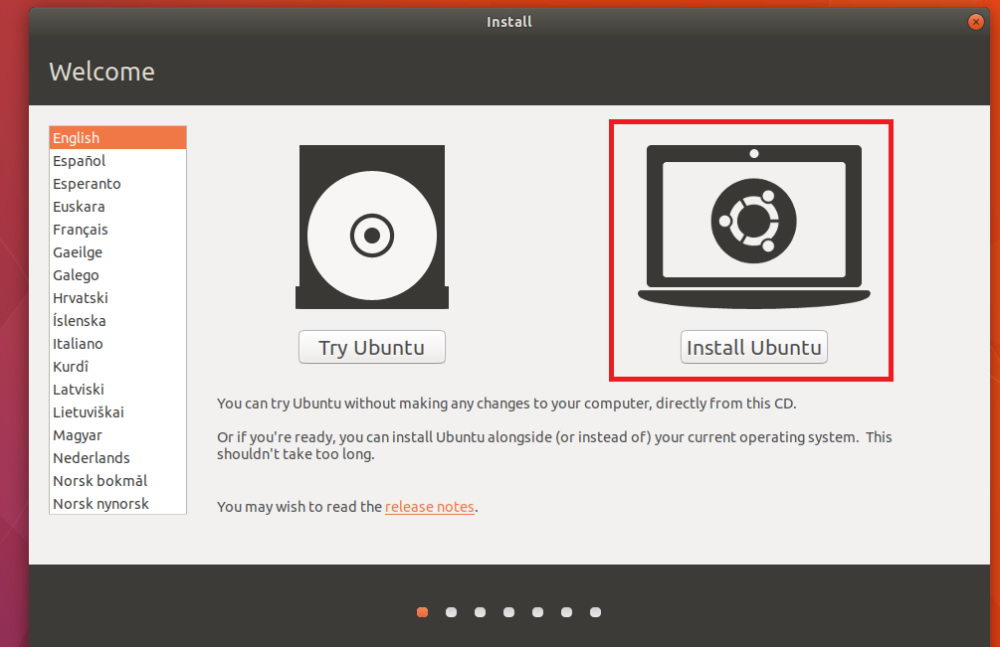

# big-data-dev-environment

Instruction how to setup Big Data local development environment to speed up development.

# High level design

Virtual machine with installed linux OS and multiple services (Kafka, Elasticsearch, Kibana, MySQL).

All installed services are accessible from host machine.

# Instruction

## Download VirtualBox

Download VirtualBox from: https://www.virtualbox.org/wiki/Downloads 

## Create and configure new VM with Ubuntu OS

### Create new virtual machine

Click new VM:

Enter below settings:

### Download Ubuntu ISO

Go to website https://www.ubuntu.com/download/desktop and download Ubuntu ISO.

### Install Ubuntu OS on virtual machine

Go to storage settings for newly created virtual machine:

choose download Ubuntu ISO image:

after selecting result should look like:

Run virtual machine and start installation process:

based on https://linus.nci.nih.gov/bdge/installUbuntu.html

### Configure port forwarding for virtual machine

Go to global settings:

Add new NAT network:

Go to port forwarding rules:

Enter port forwarding rules:

Go to virtual machine settings and configure network settings:

## Install required software

### Install ansible

    sudo apt-get install ansible

### Install Oracle Java 8
    
    sudo add-apt-repository ppa:webupd8team/java
    
    sudo apt-get update
    
    sudo apt-get install oracle-java8-installer

based on: https://www.digitalocean.com/community/tutorials/how-to-install-java-with-apt-get-on-ubuntu-16-04

### Install MySQL

    sudo apt-get update
    
    sudo apt-get install mysql-server

based on: https://www.digitalocean.com/community/tutorials/how-to-install-mysql-on-ubuntu-16-04 

### Install Elasticsearch

    wget https://artifacts.elastic.co/downloads/elasticsearch/elasticsearch-5.6.3.deb
    
    sudo dpkg -i elasticsearch-5.6.3.deb
    
based on: https://www.elastic.co/downloads/elasticsearch 

### Install Kibana

    wget https://artifacts.elastic.co/downloads/kibana/kibana-5.6.3-amd64.deb
    
    sudo dpkg -i kibana-5.6.3-amd64.deb
    
based on: https://www.elastic.co/jp/downloads/kibana 

### Install Confluent platform

    wget -qO - http://packages.confluent.io/deb/3.3/archive.key | sudo apt-key add -
    
    sudo add-apt-repository "deb [arch=amd64] http://packages.confluent.io/deb/3.3 stable main"
    
    sudo apt-get update && sudo apt-get install confluent-platform-oss-2.11

based on: https://docs.confluent.io/current/installation.html#installation-apt     

### Install Docker

    sudo apt-get update
    
    sudo apt-get install apt-transport-https ca-certificates curl software-properties-common
    
    curl -fsSL https://download.docker.com/linux/ubuntu/gpg | sudo apt-key add –
    
    sudo apt-key fingerprint 0EBFCD88

    sudo add-apt-repository "deb [arch=amd64] https://download.docker.com/linux/ubuntu    $(lsb_release -cs) stable"
    
    sudo apt-get install docker-ce

based on: https://docs.docker.com/engine/installation/linux/docker-ce/ubuntu/ 

### Install Kafka topics UI

    docker pull landoop/kafka-topics-ui
    
based on: https://github.com/Landoop/kafka-topics-ui 

## Configure services

### Configure Elasticsearch

Modify configuration file ``/etc/elasticsearch/elasticsearch.yml`` and set value of option `network.host`, so that Elasticsearch will listen on all interfaces:

    network.host = [_local_, _site_] 

based on: https://www.elastic.co/guide/en/elasticsearch/reference/current/modules-network.html 

### Configure Kibana

Modify configuration file `/etc/kibana/kibana.yml` and set value of option `server.host`, so that Kibana will listen on all interfaces:
    
    server.host = 0.0.0.0

based on: https://www.elastic.co/guide/en/kibana/current/settings.html 

### Configure Kafka

Add new host to hosts file on host machine (e.g. Windows), by adding below line to ``C:\Windows\System32\drivers\etc``:

    127.0.0.1 osboxes
    
where `osboxes` is host name of guest machine (virtual machine) that can be checked with command `hostname`:

based on: https://stackoverflow.com/questions/46074839/connect-to-kafka-inside-virtualbox

### Configure MySQL

#### Modify listen host

Edit configuration file `/etc/mysql/mysql.conf.d/msqld.cnf` and change line:

    bind-address = 0.0.0.0

#### Grant access to connect from host machine 

Execute in MySQL:

    CREATE USER developer identified by ‘PASSWORD’;
    GRANT ALL ON *.* to developer@’%’;

where `developer` is name of user you should use for connecting with MySQL database.

## Start services

### Start Elasticsearch

    service elasticsearch start

### Start Kibana

    service kibana start

### Start Kafka ecosystem

    confluent start kafka-rest

### Start MySQL

Should be started automatically, you can check it with:

    systemctl status mysql.service

### Start Kafka topics UI

    docker run --rm -it -p 8001:8000 \
                   -e "KAFKA_REST_PROXY_URL=http://localhost:8082" \
                   -e "PROXY=true" \
                   landoop/kafka-topics-ui
